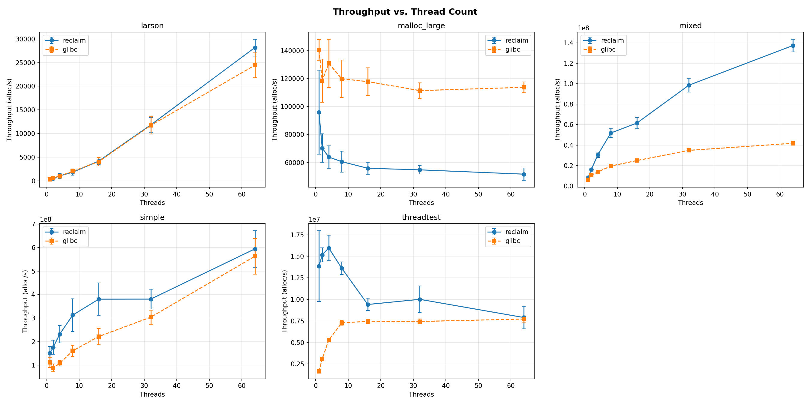
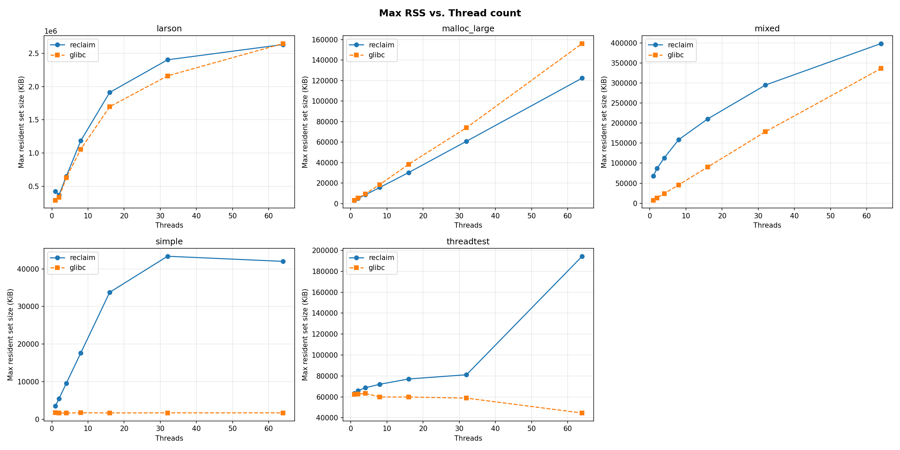

# reclaim

*Reclaim* is a scalable, thread-safe memory allocator.

## Introduction

Virtual memory management is a fundamental primitive in commodity, server, and even some embedded operating systems. This is a proposed implementation of a scalable, thread-safe allocation system for managing virtual memory.

## API

The exposed interface is quite simple, and adheres to the traditional UNIX memory management API; just `malloc` and `free`, with no support for `calloc`, `realloc` or POSIX functions like `posix_memalign`.

The only difference from a common allocator is that it's not possible to directly replace standard library implementations of `malloc`/`free` yet, but the working region must be reserved beforehand via `recl_alloc_main_heap` and then freed via `recl_free_main_heap`.

## Build and Run

The project is built as a library with Make. To build the library, just run
```bash
make lib
```
The `libreclaim` library is then linked to each of the benchmarks. 

### Benchmarks

To build benchmarks, use the `bench` target
```bash
make bench
```
or the justfile directly, which also allows you to configure your own experiments in a preset. For example, to build benchmarks and run the *scalability* test, execute
```bash
cd benchmark
just build
just scalability
```

### Unit tests

Unit tests are also provided, and they use the GoogleTest framework; to build them, just run a CMake build from the `tests` folder.

```bash
cd tests
mkdir -p build && cd build
cmake ..
cmake --build .
./reclaim_tests
```

## Architecture 

Overall, reclaim adopts a three-level architecture with a front, middle and back end:
* The **front-end** is meant to serve the majority of the allocation requests from threads. It's composed of thread-local caches
* The **middle-end** is instead shared, and it's responsible for bringing chunks in from the backend, as well as receiving batches of excess chunks from tcaches when they become too full (the threshold is configurable)
* The **back-end** is the component directly managing virtual memory. Here, new *spans* (*i.e.*, contiguous regions of memory of configurable size) are allocated when there is not enough space to serve the current request, and reclaimed to the operating system when they're not needed anymore. Allocation of the so-called *large* chunks is handled directly here, bypassing all caches.

```
recl_malloc() / recl_free()
    │
    v
┌──────────────────────────────────┐
│  Front end (thread-local caches) │ <-- per-thread
└──────────────────────────────────┘
           ^
           │ batch transfer
           v
┌──────────────────────────────┐
│  Middle end (central cache)  │ <-- shared
└──────────────────────────────┘
           ^
           │
           v
┌────────────────────────────────────┐
│  Backend (span mgmt. + largecache) │ <-- shared
└────────────────────────────────────┘
          ^
          | mmap/munmap/madvise
          V
    ┌───────────┐
    │  Kernel   |
    └───────────┘
```

### Size classes

The approach followed for size classes is inspired by [ltalloc](https://github.com/cksystemsgroup/scalloc). The space in between two powers is divided into four equal parts as follows

$$ 2^k, \dots, 1.25 \cdot 2^k, \dots, 1.5 \cdot 2^k, \dots, 1.75 \cdot 2^k, \dots, 2^{k+1} $$

By default, standard (*i.e.*, cached) allocations go from 16B to 256 KiB.
This means that, for example, an 80 bytes allocation won't be rounded to the 128B bin (leading to a considerable waste of memory), but instead to the 96B bin.

Large allocations, instead, go from 512KiB to 64MiB, following a simpler power-of-two pattern without any splitting.

Size-class resolution is implemented as pure arithmetic using `__builtin_clzl` (count-leading-zeros), deliberately avoiding any lookup table; this means the mapping from an allocation size to its bin is computed with no memory access at all.

### Front-end

The front-end directly handles user's requests; the whole concept of thread-local caches has been taken from [TCMalloc](https://github.com/google/tcmalloc), and consists in a per-thread array of lists holding free chunks which is accessible solely to the current thread, hence allowing for lock-free allocations (*i.e.*, thread won't be competing over any lock) which ensure a good deal of scalability. Thread-local caches are called *tcache*s in reclaim.

That to a tcache is meant to be the fastest allocation path, therefore the code has been instrumented with branch prediction information (`__builtin_expect` in GCC). The slow paths of refilling and flushing tcaches are annotated with `__attribute__((noinline, cold))`, which evicts them from the instruction cache and keeps the common allocation path as tight as possible.

When memory is fetched from the backend to refill a tcache, only one batch of objects is kept locally; the remainder are immediately stored to the ccache, making them available to other threads and therefore acting as a kind of load balancer. By default, the size of a batch is 32 chunks, but that can be changed.

Thread lifecycle is managed via `pthread_once` for one-time global initialisation and a `pthread_key` destructor for automatic tcache cleanup on thread exit, ensuring no memory is leaked when threads terminate.

### Middle-end

This layer hosts a central cache (or *ccache*) which is responsible to exchange chunks from the tcaches, as well as exchanging spans with the backend. To reduce traffic to/from the front end, chunks are exchanged in batches of configurable size (similar to what [ltalloc](https://github.com/r-lyeh-archived/ltalloc) does).

Contrary to the front-end, this layer is shared between threads; synchronisation is achieved via spinlocks, which are pure userspace primitves implemented via atomic compare-and-swap instructions, thus avoiding kernel transitions. Thanks to this, spinlocks are known to give, on average, less waiting overhead than mutexes.

Being the ccache accessed simultaneously, there is a risk for multiple threads to conflict over the same cache line, causing lots of evictions and reducing performance; each bin has therefore been aligned to a configurable cache line size (64B by default).

### Back-end

The back-end deals with *spans* instead of chunks. Spans are fixed at 2 MiB and are always 2 MiB-aligned. Such an alignment allows to recover the owning span at which a chunk is mapped to via a single bitwise operation (see [code](https://github.com/nicolasbenatti/reclaim/blob/main/src/backend.c)), avoiding any metadata or reverse-mapping table.

Here, memory is managed directly via `mmap`/`munmap` and `madvise` system calls. Two data structures are maintained at this level; a span cache (*scache*), keeping track of free spans, and a large cache (*lcache*) doing the same thing for large allocations. The choice of keeping them separate was made deliberately to allow handling the two allocation paths separately as the project evolves.

Allocations of such big portions of memory are considered to be very infrequent, therefore there is no central nor thread-local cache referencing them; instead, the backend maintains a freelist for each bin.

## Evaluation

Reclaim is meant to be a performance-oriented allocator. Therefore, the project includes a small (yet significant) benchmark suite, which compares reclaim with `malloc` and `free` implementations from glibc, which uses the [ptmalloc2](https://elixir.bootlin.com/glibc/glibc-2.43.9000/source/malloc) allocator.

The main dimensions alongside which reclaim is measured are performance (*i.e.* how *fast* allocations are performed) and scalability (*i.e.* how well this performance is preserved as parallelism increases).
To achieve this, two main metrics are considered:
* **Throughput**, defined as no. of allocations per second
* **Max resident set size** (MaxRSS), which accounts for the maximum memory footprint observed during a benchmark run 

## Benchmarks

There are a total of 5 benchmarks, either made up or taken from literature:
* `simple`: each thread allocates and frees fixed-size chunks in a loop
* `mixed`: same as `simple`, but each thread randomly chooses whether to allocate or free memory at each iteration
* `larson`: adapted from [mimalloc-bench](https://github.com/daanx/mimalloc-bench), tests remote allocations (*i.e.*, situations in which memory is allocated by a thread and free'd by a different one) by having each thread spawn a dedicated terminator thread upon completion, which takes ownership of the pre-allocated blocks and frees them
* `threadtest`: adapted from Hoard's benchmark [suite](https://github.com/emeryberger/Hoard/tree/master/benchmarks), each thread repeatedly allocates a full batch of fixed-size chunks, performs a configurable amount of work between each operation, then frees the entire batch; this simulates a realistic workload where memory operations are interleaved with computation
* `malloc_large`: adapted from [mimalloc-bench](https://github.com/daanx/mimalloc-bench), tests the large allocation path by repeatedly allocating random-sized blocks between 5 and 25 MiB, keeping up to 20 live at a time

Starting from these benchmarks, the Justfile defines several recipes, each being a different scenario of interest. The results for `scalability` is reported.

The table below lists the fixed parameters used in the `scalability` test (threads vary from 1 to 64):

| Benchmark      | Iterations | Chunk / block size | Other fixed parameters |
|----------------|------------|--------------------|------------------------|
| `simple`       | 500,000    | 128 B              | —                      |
| `mixed`        | 500,000    | 1 B – 40 KiB (random) | max 256 live objects |
| `malloc_large` | 500        | 5 – 25 MiB (random) | max 20 live blocks   |
| `threadtest`   | 50         | 2 KiB            | 30,000 chunks total, work coefficient 0 |
| `larson`       | 50         | 10 – 500 B (random) | 100 chunks per thread, 10 s sleep |

Please refer to the specific benchmarks' source code for better understanding what the most specific parameters mean.

## Results

### Throughput vs. number of threads



In these plots, each data point reports mean and std. deviation over 10 runs.
Reclaim scales well on allocation-heavy workloads (`simple`, `mixed`, `larson`), consistently outperforming glibc as thread count grows. On the other hand, malloc_large highlights that reclaim still needs optimisation of the large allocation path; the reason for such a degrade in performance is probably due to the increased number of `mmap`/`munmap` syscalls performed by the backend to maintain the alignment of large chunks. 
The use of lock-free data structures in the backend exclusively for handling this path could also be explored.

### Memory footprint

The following plots show the high watermark for memory occupation (resident set) across 10 runs of every benchmark. This information has been obtained via the `getrusage` syscall.



From this plot, the memory-performance trade off is clearly visible, with a maximum increase of 24 times for the `simple` benchmark. This is probably due to the 2MiB fixed alignment of spans; this was done to favour performance, but of course leads to higher fragmentation of memory.

## Use of generative AI

LLMs were used to assist development in the following areas:
* Initial problem space exploration, as well as obtaining information about existing designs
* Setup of the benchmarking infrastructure (Just file, plotting scripts, porting of benchmarks from [mimalloc-bench](https://github.com/daanx/mimalloc-bench))
* Writing unit tests